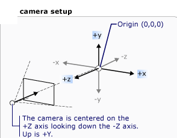
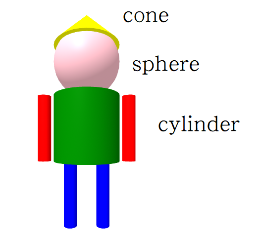

# -動手玩程式
## 單元10 3D動畫位置調整
### 程序 參考單元8
### 位置調整
position = "x y z" 起點 <br/>
to : x y z;  終點 <br/>
dur : t; 時間 0.001 秒 <br/>
rotation="x y z" 旋轉 <br/>
### 拍攝全景相片
```
<a-sky src="r2.jpg" rotation="0 0 -6"></a-sky>
```
## 單元9 3D動畫位置調整
### 程序 參考單元8
### 位置調整
position="0 0 -2"<br/>
animation : to : x,y,z; <br/>
rotation="0 0 0"<br/>
## 單元8 3D動畫
### 程序
下載：<br/>
網址：https://dotnet.microsoft.com/download <br/>
安裝<br/>
下載上週範例w7.7z：https://github.com/csjou-hwu/coding1082/blob/master/w7.7z <br/>
解壓縮 w7.7z<br/>
改名 w7 -> w8 <br/>
開啟命令提示字元 cmd<br/>
切換目錄(工作) cd Downloads\w7<br/>
檢查網址設定(10.231.166.xx) ipconfig <br/>
dotnet run<br/>
chrome https://10.231.166.xx/w0701.html <br/>
下載寶可夢 pokemon.7z：https://github.com/csjou-hwu/coding1082/blob/master/pokemon.7z <br/>
解壓縮 pokemon.7z<br/>
複製 3D模型檔 wwwroot<br/>
下載操場圖片 pokemon.7z：https://github.com/csjou-hwu/coding1082/blob/master/Figs/R0011133.JPG <br/>
複製 圖檔 wwwroot<br/>
加入 wwwroot/wk0801.html <br/>
內容參考網址： https://aframe.io/docs/1.0.0/primitives/a-obj-model.html<br/>
chrome https://10.231.166.20/w0801.html <br/>
平板測試<br/>
影片：https://youtu.be/5ZCQmyTXq_U <br/>

## 單元7 動畫
### 程序
下載：<br/>
網址：https://dotnet.microsoft.com/download <br/>
安裝<br/>
下載上週範例w6.7z：https://github.com/csjou-hwu/coding1082/blob/master/w6.7z <br/>
解壓縮 w6.7z<br/>
開啟命令提示字元 cmd<br/>
切換目錄(工作) cd w7<br/>
檢查網址設定 ipconfig <br/>
加入 wwwroot/wk0701.html <br/>
內容參考網址： https://aframe.io/docs/1.0.0/components/animation.html <br/>
dotnet run<br/>
chrome https://10.231.166.20/w0701.html <br/>
動畫 animation="property: position; to: 1 8 -10; dur: 2000; easing: linear; loop: true"<br/>
平板測試<br/>
參考網址： https://www.ghacks.net/2019/03/21/google-adds-sensor-permission-controls-to-chrome/ <br/>
感測器啟用 : chrome://settings/content/sensors <br/>
影片<br/>
https://youtu.be/skHE_9or-zo <br/>

## 單元6 複習電腦基本指令+模型匯入
認單字：<br/>
download<br/>
dotnet run<br/>
ipconfig<br/>
cd 目錄<br/>
cd ..<br/>
box<br/>
position<br/>
color<br/>
sky<br/>
model<br/>
cmd<br/>
### 程序
下載：<br/>
網址：https://dotnet.microsoft.com/download <br/>
安裝<br/>
下載上週範例w5.7z：https://github.com/csjou-hwu/coding1082/blob/master/w5.7z <br/>
解壓縮 w5.7z<br/>
開啟命令提示字元 cmd<br/>
切換目錄(工作) cd w5<br/>
檢查網址設定 ipconfig <br/>
加入 wwwroot/wk0601.html <br/>
內容參考網址： https://aframe.io/docs/1.0.0/primitives/a-obj-model.html <br/>
下載pikachu.7z：https://github.com/csjou-hwu/coding1082/blob/master/pikachu.7z <br/>
dotnet run<br/>
chrome https://網址/w0601.html <br/>
調整位置 position="左右  上下  前後"<br/>
影片<br/>
https://www.youtube.com/watch?v=g9CpC2xpLR8 <br/>
https://www.youtube.com/watch?v=xgU4xSzVu4I <br/>


## 單元5 複習電腦基本操作與指令+3D場景
內容參考網址： https://aframe.io/docs/1.0.0/primitives/a-sky.html <br/>
下載 Street1.jpg https://github.com/csjou-hwu/coding1082/blob/master/Street1.jpg <br/>
w0401.html 加入(w0501.html)<br/>
<a-sky src="Street1.jpg"></a-sky>
瀏覽器看結果 chrome https://網址/w0501.html <br/>
影片<br/>
https://www.youtube.com/watch?v=MRJCj0RG2kg <br/>
https://www.youtube.com/watch?v=ke_YzESeRuk <br/>

## 單元4 複習電腦基本操作與指令
### 3D基本概念
1. 製作單元3程式<br/>
2. 參考虛擬相機，建立自己的積木堆<br/>
<br/>
<br/>
### 程序
下載：<br/>
網址：https://dotnet.microsoft.com/download <br/>
安裝<br/>
開啟命令提示字元 cmd<br/>
下載上週範例w4.7z：https://github.com/csjou-hwu/coding1082/blob/master/w4.7z <br/>
解壓縮 w4.7z<br/>
切換目錄(工作) cd w4<br/>
檢查網址設定 ipconfig <br/>
執行程式 dotnet run<br/>
瀏覽器看結果 chrome https://網址/w0401.html <br/>

## 單元3 複習電腦基本操作與指令
### 程序
下載：<br/>
網址：https://dotnet.microsoft.com/download <br/>
安裝<br/>
開啟命令提示字元 cmd<br/>
建立範本程式 dotnet new web -o wk02<br/>
切換目錄(工作) cd wk02<br/>
檢查網址設定 ipconfig <br/>
修改Program.cs 加入 webBuilder.UseUrls("https://網址/"); <br/>
修改Startup.cs 加入 app.UseStaticFiles()<br/>
加入 wwwroot/wk0301.html <br/>
內容參考網址： https://aframe.io/docs/1.0.0/introduction/<br/>
dotnet run<br/>
chrome https://網址/wk0301.html <br/>
影片<br/>
https://www.youtube.com/watch?v=WnYKd3tTvAM <br/>

## 單元2 電腦基本操作與指令
https://docs.google.com/document/d/1UOaGnfu2LBeAEbuEu4agfoPtqMVIILXRGa784MzV9og/view <br/>
影片<br/>
https://www.youtube.com/watch?v=5mjFLwRMpxo

## 單元1 課程與教學環境簡介
https://docs.google.com/document/d/1a1NWrNW55fYC8nmGJXpZ8ekapWMWvh6rx0WNrlu9Wq0/view <br/>
影片<br/>
https://www.youtube.com/watch?v=81NrExkyCU8 <br/>

## 網路執行程式
https://www.w3schools.com/ <br/>
虛擬實境程式 <br/>
https://aframe.io
